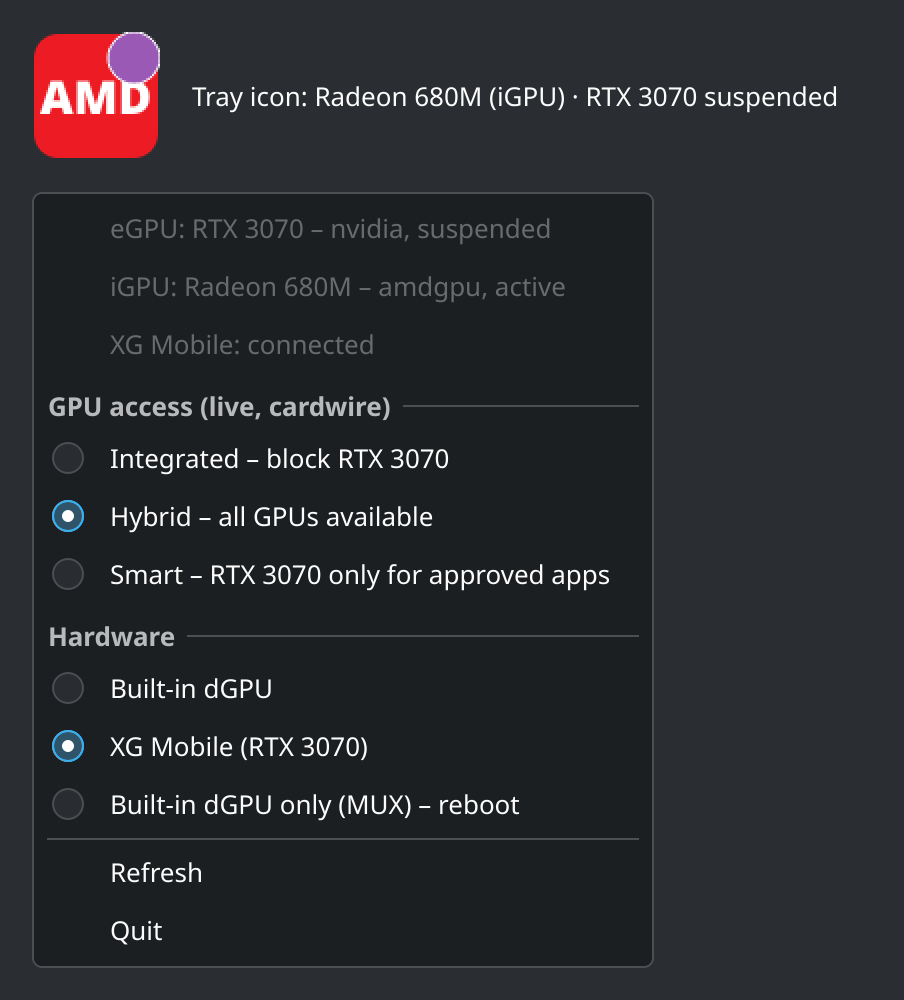

# Asus GPU Tray

A system tray icon for Linux that shows which GPU is currently rendering and switches GPU modes:

- **live** GPU access modes (Integrated / Hybrid / Smart) through [cardwire](https://github.com/OpenGamingCollective/cardwire),
  with no reboot or logout;
- **hardware** modes on ASUS laptops, which cardwire does not handle: built-in dGPU ⇄ **XG Mobile**
  eGPU dock **live, without a reboot** (~40 s), and the MUX (dGPU-only) mode during the next boot.

It detects the installed graphics cards by itself and only offers what your hardware supports.



ROG Control Center (asusctl 6.5) has no eGPU switch, and supergfxctl is deprecated in favour of
cardwire, which does not support eGPUs yet. That gap is why this tool exists.

Developed and tested on an ASUS ROG Flow X16 GV601RE (Radeon 680M + RTX 3050 Ti, XG Mobile with
RTX 3070) running CachyOS with KDE Plasma.

## Features

- Lists every graphics card and classifies it as **iGPU**, **dGPU** or **eGPU**, with its name
  (from `hwdata`'s `pci.ids`), driver, runtime power state and whether cardwire blocks it.
- **GPU access (live, cardwire):** Integrated blocks the dGPU/eGPU for new apps, Hybrid allows all
  GPUs, Smart allows the dGPU only for approved apps. Uses `cardwire set <mode>`, takes effect
  immediately; already running apps keep their GPU until restarted.
- **Hardware (ASUS only):** built-in dGPU and XG Mobile switch live, without a reboot; the dGPU-only
  MUX mode is marked "– reboot". XG Mobile is greyed out until the dock is connected and locked.
  If a live switch cannot run (for example a game still uses the card), the tray offers to switch
  with a reboot instead.
- Falls back to supergfxd modes when cardwire is not installed, and works as a read-only GPU viewer
  without either.
- Never wakes a runtime-suspended dGPU: it reads only kernel-cached sysfs files and cardwire's device
  list, never `lspci`, `nvidia-smi` or `/dev/nvidia*`. (Waking the dGPU makes ROG Control Center spam
  "dGPU status changed" notifications.)

## Icon

| Icon | Meaning |
|---|---|
| NVIDIA logo | an NVIDIA card is rendering |
| red **AMD** | an AMD card is rendering |
| blue **Intel** | an Intel card is rendering |
| grey **GPU** / **?** | unknown vendor / no GPU detected |
| purple dot | an external GPU is attached (XG Mobile mode / Thunderbolt eGPU) |

"Rendering" means the dGPU/eGPU is awake, has a driver and is not blocked; otherwise the iGPU is
shown (or the dGPU in MUX mode, where it drives the panel). Hover for details, left-click for a
notification with the active GPU, right-click for the menu.

## How GPUs are classified

| Kind | Rule |
|---|---|
| iGPU | Intel card on PCI bus 0, or an AMD card whose PCI bus also contains USB controllers (an APU) |
| eGPU | an ancestor PCIe port has `external_facing = 1` or the device is `removable` (Thunderbolt / USB4), or it is an NVIDIA card while ASUS `egpu_enable = 1` (XG Mobile) |
| dGPU | anything else |

cardwire hides a blocked GPU's sysfs files from every process (even root), so blocked cards are
taken from `cardwire list --json` instead.

## Hardware switching (ASUS)

There are two paths: built-in dGPU ⇄ XG Mobile switches **live** (see
[Live switching](#live-switching-built-in-dgpu--xg-mobile)); the MUX mode, and the fallback when a
live switch cannot run, are applied **during the next boot**.

### Switching with a reboot

supergfxd's own live switching unloads the NVIDIA driver on logout. With nvidia-open 615 this
**froze the system** on `rmmod nvidia` (last log line: `nvidia-modeset: Unloading`), in every
direction. So the reboot path applies the change during boot, before the NVIDIA driver is loaded:

```
menu click
  └─ systemctl start asus-gpu-switch@<Mode>.service   (polkit: no password, only these 4 modes)
       └─ asus-gpu-switch-reboot <Mode>
            ├─ writes /var/lib/asus-gpu-tray/pending
            ├─ creates /etc/modprobe.d/zz-asus-gpu-tray-switch.conf (blacklists nvidia for one boot)
            ├─ for MUX: writes gpu_mux_mode (firmware applies it after reboot)
            └─ systemctl reboot
boot
  └─ asus-gpu-switch-apply.service   (before supergfxd, cardwired and the display manager)
       ├─ removes the NVIDIA devices from PCI (safe: the driver is not loaded)
       ├─ writes egpu_enable (1 = XG Mobile, 0 = built-in dGPU) + dgpu_disable=0
       ├─ rescans PCI so the right card appears
       ├─ sets "mode" in /etc/supergfxd.conf, if supergfxd is installed
       └─ always removes the blacklist and the pending file; without supergfxd it replays
          udev events so the NVIDIA driver loads for the new card
```

It must run before cardwired: once cardwire blocks a GPU, the script could no longer see it in sysfs.
`egpu_enable` persists in firmware across reboots.

### Safeguards

- XG Mobile cannot be selected unless the dock is connected and locked (`egpu_connected = 1`).
  Both the menu and the scripts check this.
- If the XG Mobile is disconnected at boot, `asus-gpu-switch-apply` switches to the built-in dGPU instead.
- If the `nvidia` driver is somehow already loaded, `asus-gpu-switch-apply` leaves the hardware alone
  and the system boots in the old mode. The blacklist is removed either way.
- Switch back to the built-in dGPU **before** undocking the XG Mobile.

### Live switching (built-in dGPU ⇄ XG Mobile)

Choosing the built-in dGPU or the XG Mobile in the **Hardware** section switches live, in about
40 seconds (`asus-gpu-live@<Mode>.service`, script `asus-gpu-switch-live`).
Tested in both directions on the ROG Flow X16 GV601RE:

1. closes ROG Control Center (the tray starts it again afterwards, with the same arguments) and
   stops cardwired, nvidia-powerd and supergfxd - they all keep the card open;
2. **aborts without touching the hardware** if any process still holds `/dev/nvidia*` or the
   NVIDIA card's DRM nodes - the NVIDIA driver waits forever in its PCI remove callback while the
   card is open, which is what froze the system with supergfxd's live switching;
3. unbinds the NVIDIA functions, resets them with a secondary bus reset from the root port and
   removes them from PCI;
4. masks the "Surprise Down" AER error on the root port and disables the link, then flips
   `egpu_enable` (the firmware call itself takes ~27 s);
5. re-enables the link, waits for it (the XG Mobile cable needs ~8 s), restores the AER mask,
   rescans PCI and lets the still-loaded driver bind to the new card;
6. updates supergfxd's config and restarts the stopped services.

Why step 4 matters: the root port has no surprise-removal support and treats a lost link as a
**fatal** error; on AMD platforms that means an immediate reset. Without it every attempt reset the
laptop the moment the firmware moved the lanes (next boot: `Previous system reset reason
[0x08000800]: an uncorrected error caused a data fabric sync flood event`). At boot the same switch
works without these steps because AER reporting is not set up yet.

Every step is synced to `/var/lib/asus-gpu-tray/live-progress`, so after a hard hang it shows
where it stopped.

The compositor must not use the NVIDIA card, otherwise the switch always aborts. For KDE Plasma,
give the iGPU a stable device name with a udev rule and restrict KWin to it (log in again after):

```bash
# /etc/udev/rules.d/70-asus-igpu-card.rules  (use your iGPU's PCI address)
SUBSYSTEM=="drm", KERNEL=="card[0-9]*", KERNELS=="0000:3a:00.0", SYMLINK+="dri/asus-igpu-card"

# ~/.config/plasma-workspace/env/asus-gpu-tray-kwin.sh
[ -e /dev/dri/asus-igpu-card ] && export KWIN_DRM_DEVICES=/dev/dri/asus-igpu-card
```

(`KWIN_DRM_DEVICES` is colon-separated, so `/dev/dri/by-path/pci-…` paths cannot be used.)
With this, displays connected to the XG Mobile dock's own outputs do not work; the laptop's
panel and ports wired to the iGPU do (on the GV601RE the dock's outputs do not work with the NVIDIA
driver anyway). Close games and other apps that use the NVIDIA GPU before switching. KWin still opens the NVIDIA card through glvnd's NVIDIA
EGL driver, so also load only Mesa's EGL in KWin (user drop-in, affects only the compositor):

```ini
# ~/.config/systemd/user/plasma-kwin_wayland.service.d/asus-gpu-tray.conf
[Service]
Environment=__EGL_VENDOR_LIBRARY_FILENAMES=/usr/share/glvnd/egl_vendor.d/50_mesa.json
```

If the switch is aborted, nothing is changed and the tray offers to switch with a reboot instead.

## Requirements

- Python 3.10+ with PyQt6 (`python-pyqt6` on Arch)
- `hwdata` (for `/usr/share/hwdata/pci.ids`)
- [cardwire](https://github.com/OpenGamingCollective/cardwire) for live GPU modes (recommended;
  needs a kernel with BPF LSM enabled and Wayland), or supergfxd as a fallback
- A kernel with the `asus-armoury` driver for XG Mobile, MUX and the reboot backend (optional)
- A desktop with a system tray (tested on KDE Plasma)

## Installation

```bash
git clone https://github.com/jkocon/Asus_GPU_Tray.git
cd Asus_GPU_Tray
sudo ./install.sh
```

For live XG Mobile switching on KDE Plasma, also do the one-time KWin setup described in
[Live switching](#live-switching-built-in-dgpu--xg-mobile). Install cardwire separately, following its
[installation guide](https://opengamingcollective.github.io/cardwire/getting-started/installation.html).

The tray starts on the next login. To start it now: `python3 /usr/local/lib/asus-gpu-tray/asus_gpu_tray.py &`.
After closing it, start it again from the application menu (**Asus GPU Tray**, System category).
Only one instance runs per session.

To try it without installing: `python3 asus_gpu_tray.py`. Use `python3 asus_gpu_tray.py --dump` to
print what was detected without the GUI.

Installed files:

| File | Purpose |
|---|---|
| `/usr/local/lib/asus-gpu-tray/asus_gpu_tray.py` | tray application |
| `/usr/local/lib/asus-gpu-tray/asus-gpu-switch-reboot` | schedules the change and reboots (ASUS only) |
| `/usr/local/lib/asus-gpu-tray/asus-gpu-switch-apply` | applies the change at boot (ASUS only) |
| `/etc/systemd/system/asus-gpu-switch@.service` | runs `asus-gpu-switch-reboot` (ASUS only) |
| `/etc/systemd/system/asus-gpu-switch-apply.service` | runs `asus-gpu-switch-apply`, enabled (ASUS only) |
| `/etc/polkit-1/rules.d/50-asus-gpu-tray.rules` | lets the `wheel` group start `asus-gpu-switch@<mode>` without a password (ASUS only) |
| `/etc/xdg/autostart/asus-gpu-tray.desktop` | autostart on login |
| `/usr/local/share/applications/asus-gpu-tray.desktop` | application menu entry |
| `/usr/local/share/icons/hicolor/scalable/apps/asus-gpu-tray.svg` | application icon |

Uninstall: `sudo ./uninstall.sh`.

## Troubleshooting

```bash
python3 asus_gpu_tray.py --dump                  # detected GPUs, modes and backends
cardwire get; cardwire list                      # cardwire mode and blocked GPUs
journalctl -b -u asus-gpu-switch-apply           # what was done at the last boot
journalctl -b -1 -u 'asus-gpu-switch@*'          # scheduling of the change (previous boot)
cat /sys/class/firmware-attributes/asus-armoury/attributes/{egpu_connected,egpu_enable,gpu_mux_mode}/current_value
```

Cancel a scheduled hardware change manually (before rebooting):
`sudo rm /var/lib/asus-gpu-tray/pending /etc/modprobe.d/zz-asus-gpu-tray-switch.conf`.

## Known issues

- **Extra power cycle after a reboot switch from XG Mobile to the built-in dGPU** (seen once on the
  GV601RE with supergfxd disabled). The first boot showed a black screen and the laptop restarted by
  itself before Linux started; the second boot came up fine and the switch was applied. Linux logged
  a normal software reboot (`reset reason: software wrote 0xE to reset control register 0xCF9`), so
  the extra restart happened in the firmware during POST. Cause unknown.
- **Black screen for ~35 s while a reboot switch is applied.** The firmware call behind
  `egpu_enable` takes about 29 s, and the display manager waits for `asus-gpu-switch-apply` so it
  cannot grab the NVIDIA card mid-switch. Nothing is shown during the wait yet.

## Limitations

- The classification heuristics have only been tested on the ROG Flow X16 GV601RE.
  Thunderbolt eGPUs and Intel laptops are untested - reports and `--dump` output are welcome.
- cardwire is in early development; its CLI output may change between versions.
- If a laptop has several cards of the same kind, only the first one is used for labels.
- The reboot backend only handles NVIDIA dGPUs/eGPUs, which covers all XG Mobile models.

## License

GPL-3.0-or-later, see [LICENSE](LICENSE). The NVIDIA logo shape in `icons/nvidia.svg` comes from the
[char-white](https://github.com/CachyOS/char-white) icon theme (GPL).
